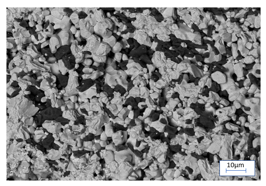
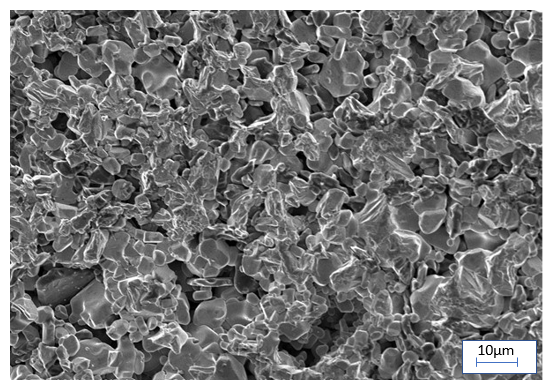

## Post test
1)	Which signals arise from top 1 nm of the sample? 
<b>a) Auger electron</b>    b) Secondary Electron    c) Backscattered electron    d) X-rays?  
2)	Which signals arise from top 5-10 nm of the sample? 
a) Auger electron   <b>b) Secondary Electron</b>   c) Backscattered electron   d) X-rays?  
3)	Which signals arise from top 0.5-1 µm of the sample?  
a) Auger electron    b) Secondary Electron    <b>c) Backscattered electron</b>    d) X-rays?  
4)	Secondary electron is ______________________ electron. 
a) elastically  scattered  <b>b) inelastically scattered</b>  
5)	Backscattered electron is ______________________ electron. 
<b>a) elastically scattered</b>  b) inelastically scattered 

6)	The typical vacuum level in SEM is 
	a) 760 torr 	b) 1 torr 	c) 10-2 - 10-3 torr 		<b>d) 10-5 - 10-6 torr</b>  
	
7)	What could be the possible order of steps of SEM machine? 
a.	Start beam  
b.	Obtaining required vacuum 
c.	Switching on the Filament 
d.	Loading the sample  

    <b>1. d, b, c, a</b> 
	2. d, c, b, a 
	3. a, b, c, d 
	4. a, c, b, d 
8) In which mode the following image is taken, where the phases are identified?

 
<b>a.BSE</b>
b.SE

9) In which mode the following image is taken, where the topographic features are clearly identified?

 
a.BSE
<b>b.SE</b>

