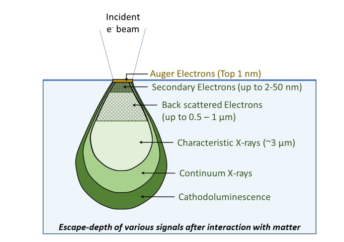
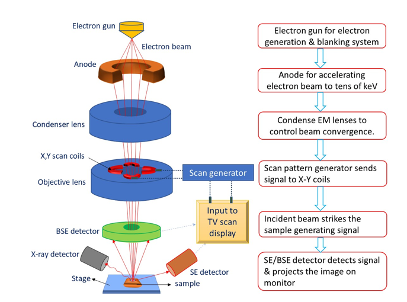
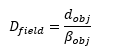
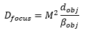
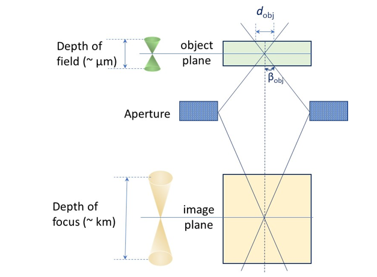

<b>Basics of Electron beam interaction with matter:</b> 

Electrons beam interaction with matter can be elicited in the Figure 1. A variety of signals, such as Auger electron, secondary electron, backscattered electron, X-rays, etc can emerge back from the surface (when sample is thick), which are utilised in Scanning Electron Microscope (SEM). On the other hand, when the sample is thin enough (or transparent to electrons), the electron beam can pass through the matter and can be utilised for imaging, and diffraction in Transmission Electron Microscope (TEM).

<video width="320" height="240" controls>
  <source src="images/exp1-sembasics.mp4" type="video/mp4">
  Your browser does not support the video tag.
</video> Video on Basics of Scanning Electron Microscopy:  Secondary Electron and BSE imaging mode

 
Fig. 1: Summary of various signals obtained by interactions of electrons with matter in a scanning electron microscope.  
<b>SEM Instrumentation:</b>  
Scanning electron microscope (SEM) is an instrument which utilises electrons for obtaining topographical images (using both secondary and backscattered electrons) and compositional contrast (using backscattered electron imaging). Micrographs obtained using secondary electron is sharper and possesses higher resolution that that of images obtained via backscattered electron. SEM can also be utilised to obtain elemental mapping using the emanated characteristic x-rays, or obtain texture in material using the electron back-scatter diffraction.  
The schematic of SEM is presented in Fig. 2.It can be witnessed that electron gun generates electron beam, which, then passes through anode-aperture. There is blanking arrangement of beam (i.e. beam stopper) to minimize sample damage. The beam is passed through condenser lens, where the divergence of incident beam is controlled by magnetic field. The objective lens then scans the sample (point by point) and the arising signals are collected for each point at secondary electron detector (for obtaining the sample topography) or back-scattered electron detector (for obtaining compositional contrast image). The scan generator controls the scan coils that allow manipulation of the scanning of the required area and also deciding the magnification of the generated image. The point by point scanning allows the detection of information through the detectors. It may be noted that the screen size is fixed, so scanning of small area of sample results higher magnification, whereas scanning of large area of sample results lower magnification. The presence of x-ray detector may also be noted in Fig. 2, which is utilised for detecting the characteristic x-ray of the elements present in the sample for elemental analysis. The role of vacuum, filament, spot size and voltage are presented in the following section: 
 
Fig. 2: Schematic of scanning electron microscope eliciting the incidence of electrons through various electromagnetic lenses, followed by scanning the sample surface and collecting the signals (secondary electrons or backscattered electrons) to generate the final image.   
<b>Importance of Vacuum, Filament, Spot Size and High Voltage:</b>  
<b>Vacuum:</b> 
Electrons need to travel from electron gun to the sample surface, and then again, the primary/secondary electrons need to reach detector for further processing. Thus, high vacuum level (> 10-5 torr) is required for minimizing electron scattering and capturing good quality images. Typically, oil-diffusion pump backed with rotary pump are used in the SEM. Though, low vacuum levels of ~10-2 torr may be required when working with biological/polymeric samples in environmental SEMs. In addition, high vacuum level also assists in avoiding contamination or oxidation of substrate and restricting any electrode discharging (from cathode filament to anode). 
<b>Filament:</b> 
An electron gun serves as source of electron that are required for consequent imaging and characterisation. Typically, W-filament is utilised as thermionic source or LaB6 (Lanthanum hexaboride), CeB6 (cerium hexaboride), or FEG (field-emission gun, which can be cold-cathode (using W) or Schottky (W coated with ZrO2) emitters) are also utilised as source of electron. FEG sources can result higher resolution (down to 1-2 nm) with 1000 times more brightness than conventional W-filament. Fine spot size of electron beam helps in improving resolution as well as obtaining high brightness of the captured images. There are set of condenser and objective electromagnetic lenses to guide the electrons to the sample surface. The electrons experience Lorentz force and move in helical path in the applied electromagnetic field. 
<b>Accelerating Voltage (Energy):</b> 
Typically, 5 kV – 30 kV is utilised for accelerating the electrons generated by the filament. Note that the values are in kilo-volts! There are set of electromagnetic lenses that accelerate the electrons for reaching the sample for consequent detection. At lower voltages (< 5 kV), there is high scatter of electrons, and poor image-resolution is obtained. Whereas, at higher beam voltages (> 15-20 kV), there can be excessive sample damage. There can be enough sample-charging (since electrons are being bombarded on sample for imaging) especially on ceramic and polymeric samples. So, it is preferred to utilise lower beam voltage for these samples (and also for biological samples). This also mandates that a conductive coating (of gold or carbon) be deposited for effective imaging. Metal samples can handle higher voltages and may not require any coating as they are inherently conducting. 
<b>Spot Size of Electron Beam:</b> 
Spot size of electron beam plays a strong role in deciding the resolution of the image. As the beam size is decreased, now a smaller area is incident with electrons. Thereby, now, a smaller interaction volume participates in the generation of signals, and enhances the resolution. At the same time, as the intensity of electrons lowers (due to smaller beam size), the brightness of the generated image become inferior compared to that of the larger spot size condition. Nonetheless, the brightness parameters (or the beam current) will need to be increased to observe similar quality of the image. The differences due to spot size become more evident at high magnifications (say exceeding 10,000 x).  
<b>Secondary and Back-Scattered Electrons:</b>  
<b>Secondary Electrons:</b> 
The high energy incident (or primary) electron at 5 kV – 30 kV (with energy ranging from 5 keV to 30 keV, respectively) knocks out the electron from outer/inner shell of the matter (or substrate) giving rise to secondary electron. Secondary electron is inelastically scattered electron (i.e. the primary electron loses energy after knocking out secondary electron) and is utilised in obtaining the surface topography. Typically, secondary electrons possess energy < 50 eV. Since the intensity of secondary electrons is obtained from the top ~ 2 - 50 nm surface depth, a very high resolution of images is obtained. In addition, interaction of incident electrons is higher when the surface is inclined (i.e. more vertical, inclined or spherical rather than horizontal) giving rise to higher brightness (or topographical contrast). Low energy (< 50 eV) of secondary electron (SE) allows the detector to be placed farther, but now a bias (or voltage) is applied to the tune of ~ 200 V to capture these secondary electrons for imaging. In the process, the electrons experiencing any hurdle in the line of sight (of low energy <50 eV electrons) can also be captured due to high bias present in the detector. Thus, there is no shadow effect during the imaging from secondary electrons. 
<b>Back-scattered Electrons:</b> 
The high energy primary electron may also ‘elastically’ interact with the matter and after multiple elastic scattering may emerge from the surface as ‘back-scattered electron’. In rare cases, the primary electron may also be trapped by the positively charged nucleus of substrate and may emerge from the surface after orbiting around the positively charged nucleus. In both these processes, the energy of the primary electron is almost conserved and the resulting electrons are ‘back-scattered electrons’. In the process, the energy of back-scattered electrons is almost similar to that of incident electrons (~ 5 keV to 30 keV). Since the interaction is largely due to elastic scattering with the electron cloud of matter, their density is proportional to the atomic size (or on average atomic number) of the material. Higher atomic number elements typically provide high back-scattered electrons (and show up as ‘bright’ features compared to that of low atomic number materials). This difference in the image (obtained from back-scattered electrons) due to difference in the composition (or atomic number) is called as ‘compositional contrast’. When compared to that of secondary electron imaging, the resolution of back-scattered electron images is lower. As the back-scattered electrons (BSE) possess energy similar to that of incident electrons, the BSE detector is kept very near to the incident beam axis. Apparently, this effect also leads to ‘shadow effect’ when the back-scattered electrons experience any hurdle during the line of sight (i.e. similar to that during the travel of light being blocked by any object).  
<b>Depth of field/ Depth of Focus:</b> 
<b>Depth of field</b>(Dfield) is the ability of the final image to remain in focus (and sharp) when the object is moved along the beam axis, Figure 3.  In other words, the distance by which the nearest to farthest region of object which remain in focus is called as depth of field. 
 
where dobj is the working distance (of objective lens) and βobj is the semiangle of objective aperture.
As noted, if multiple features are required to be kept in focus (i.e. eyes and limbs of an insect), then a higher working distance (i.e. keeping the sample at farther distance) will increase the depth of field. Depth of field can be changed from few µm to few mm in SEM. Depth of field must be high for an instrument for being able to image rough samples.   
<b>Depth of focus</b> (Dfocus) is the ability of the final image to remain in focus (and sharp) when the image plane is moved along the beam axis, Figure 3.  In other words, the distance by which there is no loss in sharpness of feature when the image plane is moved from closest to farthest is called as depth of focus. 
 
Depth of focus involves square of magnification (M), and this value runs in order of kilometres. This quantity becomes important when the images is projected on the screen, whereas the capturing (using digital camera) can be placed approximately 1 m below the imaging screen. 
 
Figure 3: The concept of depth of field (along object plane) and depth of focus (along image plane). Note that the depth-of-field is to the tune of ~&micro;m, whereas the depth of focus can be as high as order of ~km.  
<b>Note:</b> It must be mentioned that the signals (Auger electron, secondary electron, back-scattered electron, x-rays, etc) are ‘also’ arising in the bulk, but are able to come out from top-surface only from the mentioned depth. In other words, the signals generated in the bulk are attenuated (or absorbed) within the material and are NOT detectable at top-surface. Since the detector can only be kept ‘outside’ (and NOT in the bulk of material), thus, the imaging/topographic/compositional/elemental information may be obtained only from the mentioned interaction depth from top surface.  

Additional Resource of NPTEL Lecture (Prof. S. Sankaran, 
Link: https://youtu.be/mC0rYNlMz9Q)  
Myscope Training SEM Lab https://myscope.training/#/SEMlevel_3_1 

