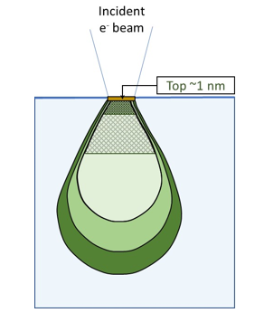
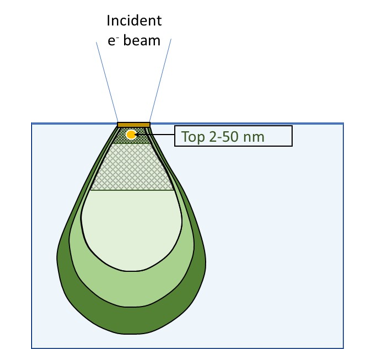
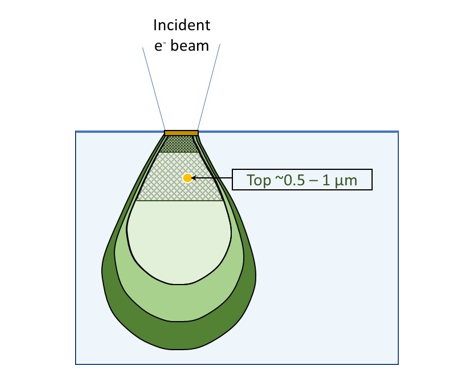

## <b> Pre-test
#### Please attempt the following questions

1. The typical vacuum level in SEM is 
a) 760 torr 	b) 1 torr 	c) 10-2 -10-3 torr 		<b>d) 10-5-10-6 torr</b>  

2. Which filament is conventionally used for thermionic emission? 
a)	Pt 	b) Pt-r 	<b>c) W</b> 	d) ZrO2  

3. What is the typical accelerating voltage used in SEM for imaging conducting or gold-coated materials?  
a)	220 V 	b) 440 V 	c) 5 kV 		<b>d) 20 kV</b>  

4) Which signal will be obtained here (top ~1 nm)? 
 
<b>a) Auger electron </b>
b) Secondary Electron 
c) Backscattered electron 
d) X-rays 

5) Which signal will be obtained here (top 2-50 nm region)? 
 
a) Auger electron 
<b>b) Secondary Electron </b>
c) Backscattered electron 
d) X-rays 

6) Which signal will be obtained here (up to top 0.5 – 1.0 µm region)? 
 
a) Auger electron 
b) Secondary Electron  
<b>c) Backscattered electron</b> 
d) X-rays?