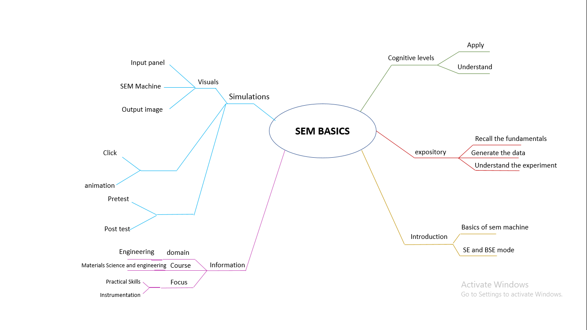

## Storyboard (Round 2)

Experiment 1: Basics of Scanning Electron Microscopy: Secondary Electron and BSE imaging mode

### 1. Story Outline:

Scanning electron microscope (SEM) is an instrument which utilises electrons for obtaining topographical images (using both secondary and backscattered electrons) and compositional contrast (using backscattered electron imaging). Micrographs obtained using secondary electron is sharper and possesses higher resolution that that of images obtained via backscattered electron. SEM can also be utilised to obtain elemental mapping using the emanated characteristic x-rays, or obtain texture in material using the electron back-scatter diffraction.
The simulator depicts all the important steps of SEM instrument to let student understand the Each step involved in SEM machine.

### 2. Story:

Scanning electron microscope (SEM) is an instrument which utilises electrons for obtaining topographical images (using both secondary and backscattered electrons) and compositional contrast (using backscattered electron imaging). Micrographs obtained using secondary electron is sharper and possesses higher resolution that that of images obtained via backscattered electron. SEM can also be utilised to obtain elemental mapping using the emanated characteristic x-rays, or obtain texture in material using the electron back-scatter diffraction.
Simulator starts with switching on the machine and let student to understand all the important step and procedure involved in operating a SEM instrument.
#### 2.1 Set the Visual Stage Description:
The Simulator screen contains three sections. One is at the left most part of the simulator that contains all the operating buttons of simulator, 
the other is the middle part of simulator that contains the SEM machine and the third part is the output image section which shows the output of each step of simulator.

#### 2.2 Set User Objectives & Goals:
learn the basic requirements for operating of SEM and understand the importance of Vacuum, filament, and high voltage. 
To let student understand how to perform secondary electron (SE) imaging 
To let student understand how to perform back-scattered electron (BSE) imaging 
#### 2.3 Set the Pathway Activities:

Simulator starts with the machine switch on step which help student to undertand the initial procedure of machine, then it ask user to set desired vacuum level and accelerating voltage 
and accordingly output image appears, after that user is allowed to set focus and contrast of image to observe the different property of images.
##### 2.4 Set Challenges and Questions/Complexity/Variations in Questions:
User is given option to set different vacuum levels and to change the accelerating voltage value which act as a challenge for user to understand the importance of  
vacuum and accelerating voltage.

##### 2.5 Allow pitfalls:
User is given option to set 
##### 2.6 Conclusion:
Describe conclusion here : (guide: This may include displaying: how much time did the user take to solve the questions/ How many questions were right?/ How many hints did the learner use. Based on this the evaluation/marking to be suggested to the user. (once he is towards the completion of the experiment, what LO he is taking along with him, what will be his probable, interpretation/conclusion , descriptive) )

##### 2.7 Equations/formulas: NA
Type equations here : (guide : ( a separate sheet having equations / programs for the lab exper3ment to be shared along with the Story submissions (1) . You can mark it as numerical reference numbers within the story narration (like we cite in the research papers) and then separately share these equations/programs sheets as a reference, do not include the equations as a whole in the narration))
Tool can be used to integrate formula in Markdown <b> [here](http://latex.codecogs.com/eqneditor/samples/example3.php) </b>

### 3. Flowchart 4
 
link to flow chart Here : Store in the  /flowchart folder within Round2 folder in your repo
 
(guide :The lab proposer should extract logic from the story, prepare a flowchart from the story narration and write the algorithm to execute the black box.  use Google Drawings https://docs.google.com/drawings/ (send the link to your flowchart and also attach .png by exporting it )

### 4. Mindmap:

 Link to mindmap here : Store the mindmap in both .mm & .png extension in the  /mindmap folder and include link of only .pdf verison here
  
 (guide : An elaborate mind map (connecting all the points in the experiment flow ) should be prepared and submitted by the lab proposer. The mind map should be a clear and detailed document that takes into account all minute intri5acies involved in the development of virtual lab. The mindmap should be self-content and any developer across the globe should be able to code it with all those details. using only FreeMind http://freemind.sourceforge.net/wiki/index.php/Main_Page (send the .png file and also the original .mm extension project file. )

### 5. Storyboard :
Storyboard: <a href="Storyboard/carwiper.gif"> [here]</a>
Link to storybaord (.gif file ) here :
(guide: This document should include sketching and description scene wise (duration, action, description). Software to be used for storyboarding : https://wonderunit.com/storyboarder/ (Its a FOSS tool) . tutorial on how to use it https://www.youtube.com/watch?v=LAeCEpG0KX4
